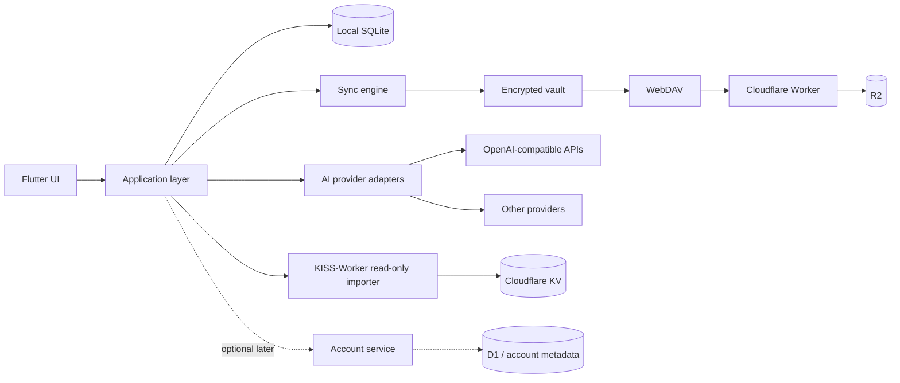

# Architecture

## Product boundary

The first Android version does not require a Vocab-owned server. SQLite is the
local source of truth; WebDAV stores an encrypted sync package. A small account
service can be added later when cross-device sign-in becomes necessary.

## Planned Flutter layers

- `presentation`: screens, widgets, interaction state.
- `application`: review sessions, imports, sync orchestration, AI conversations.
- `domain`: words, sentence patterns, learning events, progress, conflict rules.
- `infrastructure`: SQLite, secure storage, WebDAV, API provider adapters.

Feature code will be grouped by product capability while shared contracts stay
small. A repository interface separates local storage from UI so SQLite can be
introduced without coupling every screen to a database package.

## Data strategy

- Store vocabulary, patterns, review history, and progress in SQLite.
- Store WebDAV passwords/tokens, AI keys, and all KISS-Worker connection values
  in Android secure storage, not SQLite.
- Encrypt the exported sync package before upload.
- Sync immutable learning events plus versioned records to reduce conflicts.
- Keep endpoint metadata in the local profile and include only non-secret config
  in the encrypted backup.

SQLite adds a native library and a small amount of code to the APK, but usually
far less than media, speech models, or large SDKs. It is appropriate for this
offline-first dataset; package size will be measured once the persistence slice
is implemented rather than estimated from placeholders.

## Server phases

1. **Self-test:** no Vocab server. Local database + direct WebDAV sync.
2. **Private beta:** optional lightweight account service for login, device list,
   and encrypted profile metadata. It must never receive plaintext vault secrets.
3. **Public release:** optional AI gateway, usage limits, remote config, and
   telemetry only if the product needs them.

Cloudflare Worker + R2 can expose the WebDAV-compatible storage path. D1 is a
possible later choice for account metadata, not the primary learning database.
